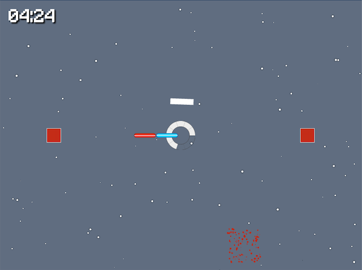

Reflektor
====

Spinning in circles and reflecting lasers

You can play it [here](http://divideby5.com/games/reflektor/)

Developed using [Phaser.js](http://phaser.io)

*  Sprites were done in Pixelmator and sprite sheets were generated using [Shoebox](http://renderhjs.net/shoebox/).
*  Sound effects were done using [bfxr](http://bfxr.net).

**Music**
At Last by Android128 from http://opengameart.org/content/at-last

** Font **

Minecraftia by Andrew Tyler from http://andrewtyler.net/fonts/
